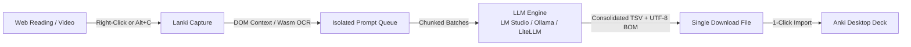

<div align="center">

# ⚡ Lanki

### AI-Powered Vocabulary Capture & Anki Flashcard Batch Generator
**Transform web reading, documents, and screen snippets into rich, multi-field Anki decks in one click.**

[](https://developer.chrome.com/docs/extensions/mv3/)
[](https://apps.ankiweb.net/)
[](./CHANGELOG.md)
[](LICENSE)
[](https://github.com/osumy/lanki)
[](https://onnxruntime.ai/)
[](https://github.com/osumy/lanki/pulls)

<p align="center">
  <a href="#-key-features">Key Features</a> •
  <a href="#-workflow--architecture">Workflow</a> •
  <a href="#-screen-snipper--dual-ocr">Dual OCR</a> •
  <a href="#-prompt-templates--anki-note-types">Prompts & Anki Setup</a> •
  <a href="#-installation">Installation</a> •
  <a href="#-backend-setup">Backend Setup</a> •
  <a href="#-how-to-use">How to Use</a> •
  <a href="#-changelog">Changelog</a>
</p>

</div>

---

## 💡 Overview

Building high-quality Anki flashcards manually is slow, disruptive, and tedious. Switching between dictionary tabs, formatting examples, and pasting translations breaks your reading flow. 

**Lanki** is a lightweight, privacy-focused Chrome Extension (Manifest V3) that streamlines your entire vocabulary-building workflow:
- **Instant Capture**: Save words directly from any webpage with automatically extracted sentence context.
- **Screen Snipper**: Snip subtitles, diagrams, or locked text anywhere on screen with in-browser offline OCR or Vision models.
- **Isolated Queues**: Maintain distinct vocabulary queues for each custom prompt template (e.g., 12-field IELTS vocabulary vs 7-field Idioms).
- **Smart Batch Generation**: Automatically splits large queues into chunks to prevent LLM token degradation and formatting drift.
- **One-Click Anki Import**: Exports a consolidated, properly formatted TSV file with UTF-8 BOM encoding for flawless multilingual rendering (Persian, English phonetics, RTL/LTR).

Works seamlessly with **local models** (LM Studio, Ollama, LiteLLM) or **cloud APIs** (OpenAI, Gemini, Claude).

---

## 🌟 Key Features

* 🎯 **Smart DOM Sentence Auto-Capture**: Highlight any word or idiom and right-click **"Add to Lanki Queue"**. Lanki inspects the DOM tree to extract the full enclosing sentence as natural context—ensuring accurate disambiguation for polysemous words.
* 📷 **Screen Area Snipper (`Alt+C`)**: Snip any region on your screen—documents, web pages, locked PDFs, diagrams, or video subtitles (YouTube, Coursera, Netflix). Includes an in-page editable review modal to verify the cropped image and transcribed text.
* ⚡ **Dual OCR Engine**:
  * **100% Offline Wasm Engine**: Runs PP-OCRv6 locally in-browser via ONNX Runtime WebAssembly. Zero external servers, zero API tokens, and complete privacy.
  * **Multimodal Vision API**: Or connect directly to local vision models (`qwen2-vl`, `moondream`) or cloud vision endpoints via LM Studio, Ollama, or LiteLLM.
* 🗂️ **Isolated Prompt-Aware Queues**: Each prompt template manages its own dedicated vocabulary queue. Switching active templates dynamically updates your queue view with live item count badges, and actions like "Clear All" or "Export" only affect the active template.
* ✨ **Dynamic Anki Headers & AI Generator**: Configure custom `#columns:...` headers per template. Use **`✨ AI Generate`** to let LLMs automatically construct compliant Anki TSV headers from your prompt instructions, or **`🔍 Quick Detect`** to parse embedded headers.
* 📦 **Smart Batch Chunking**: Large queues (e.g., 60 words) are automatically processed in configurable chunks (e.g., 10 words/batch) to avoid LLM context limits and output truncation.
* 💾 **Single Consolidated TSV Export**: Merges all generated batches into a single `.txt`/`.tsv` download formatted with UTF-8 BOM encoding for instant 1-click import into Anki Desktop without character corruption.
* 🔒 **Local & Privacy First**: No telemetry, no third-party tracking. All settings and queues remain in Chrome's local storage, and prompts can run entirely on your own hardware via Ollama or LM Studio.

---

## 🔄 Workflow & Architecture



---

## 🔍 Screen Snipper & Dual OCR

Lanki offers two distinct OCR modes to suit different hardware setups and privacy preferences:

| Feature | 🖥️ Local Offline Engine | 🌐 Dedicated Vision API |
| :--- | :--- | :--- |
| **Technology** | PP-OCRv6 via ONNX Runtime WebAssembly | Multimodal LLMs (Qwen2-VL, Moondream, GPT-4o) |
| **Runtime** | In-browser Offscreen Document (Wasm SIMD) | LM Studio (`1234`), Ollama (`11434`), LiteLLM (`4000`) |
| **Internet Required** | ❌ No (runs 100% offline on CPU) | Depends on provider (Local or Cloud) |
| **Model Options** | `v6-tiny` (~6 MB) & `v6-small` (~30 MB) | Any multimodal model supported by your server |
| **Speed** | Instant / near-instant CPU inference | Fast with GPU acceleration |
| **Setup** | 1-Click on-demand download & browser cache | Point to your local or remote endpoint URL |

---

## 📝 Prompt Templates & Anki Note Types

Lanki does not force you into a fixed flashcard structure. You can define any number of **custom prompt templates** (e.g., German vocabulary with genders, medical pharmacology cards, coding cheat sheets).

### Included Sample Templates
We provide two battle-tested templates in the [`prompts/`](./prompts/) folder:
* 📘 **[IELTS Vocabulary (12 Fields)](./prompts/word_ielts_12field.md)**: Clean lemmas, IPA phonetics, part of speech, CEFR B1/B2 graded dual examples, collocations, word families, and Persian translations.
* 🗣️ **[IELTS Idioms & Phrases (7 Fields)](./prompts/idiom_ielts_7field.md)**: Canonical idioms, Speaking vs Writing register tags, figurative imagery/origins, spoken IELTS interview examples, and Persian equivalents.

> [!TIP]
> **Customizing for Other Languages or Subjects**: You can easily feed either template to ChatGPT, Claude, or Gemini and ask:
> *"Adapt this Lanki prompt template to create a custom [X-field] Anki card for [German / French / Medical Pharmacology / etc.]. Retain the `{LIST}` placeholder and the 3 Anki TSV header lines."*

### ⚠️ Crucial: Setting Up Anki Note Types (Before First Import)
In Anki Desktop, cards belong to a **Note Type** that defines their fields.
* **Anki does NOT automatically create custom fields or Note Types when importing a text/TSV file.**
* If you import a 12-field file into Anki's default `Basic` Note Type (which has only 2 fields: `Front` and `Back`), Anki will only populate the first two columns and discard the rest!

**To set up your Note Type in Anki Desktop (30 seconds):**
1. In Anki Desktop, press **`Ctrl+Shift+N`** (or go to **Tools -> Manage Note Types**).
2. Click **Add** -> select **Add: Basic** -> name it (e.g., `Lanki - IELTS Vocabulary`).
3. Select your new Note Type, click **Fields...**, and add the fields matching your template's header (e.g., `Word`, `Phonetic`, `Audio`, `Part of Speech`...).
4. When importing (`Ctrl+I`), ensure the **Note Type** dropdown at the top matches your custom Note Type. Anki will automatically map every column 1:1.

---

## 🚀 Installation

### Load the Extension in Google Chrome
1. Clone this repository or download and extract the source archive:
   ```bash
   git clone https://github.com/osumy/lanki.git
   ```
2. Open Chrome and navigate to `chrome://extensions`.
3. Toggle on **Developer mode** in the top-right corner.
4. Click **Load unpacked** in the top-left corner.
5. Select the `lanki` project root folder.
6. Pin the **Lanki** icon to your Chrome toolbar for quick access.

---

## ⚙️ Backend Setup

Lanki connects to any OpenAI-compatible API endpoint. You can run open-source models completely locally or route requests through a proxy.

### Option A: LiteLLM Proxy (Recommended for Multi-Model Routing)
LiteLLM lets you route requests to 100+ LLMs (OpenAI, Gemini, Claude, DeepSeek, Ollama) while exposing a unified OpenAI endpoint:

```bash
# Install litellm with proxy support
pip install "litellm[proxy]"

# Run with Gemini:
export GEMINI_API_KEY="your-gemini-key"
litellm --model gemini/gemini-3.5-flash --port 4000

# Or run with OpenAI:
export OPENAI_API_KEY="your-api-key"
litellm --model gpt-4o-mini --port 4000
```
* **API Base URL**: `http://localhost:4000/v1`

### Option B: LM Studio (Local GUI)
1. Download and start [LM Studio](https://lmstudio.ai/).
2. Load any instruction-tuned model (e.g., `Qwen2.5-7B-Instruct`, `Llama-3.1-8B-Instruct`).
3. For vision snipping, load a vision model (e.g., `Qwen2-VL-7B-Instruct`).
4. Start the Local Inference Server on port `1234`.
* **API Base URL**: `http://localhost:1234/v1`

### Option C: Ollama (Local CLI)
1. Start [Ollama](https://ollama.com/):
   ```bash
   ollama run llama3.1
   # Optional vision model:
   ollama run moondream
   ```
* **API Base URL**: `http://localhost:11434/v1`

---

## 📖 How to Use

### 1. First-Time Configuration
1. Click the **Lanki** icon in your browser toolbar and open the **Settings** tab.
2. Enter your **API Base URL** (e.g., `http://localhost:4000/v1`) and **Model Name** (e.g., `gemini/gemini-3.5-flash` or `gpt-4o-mini`).
3. Set your preferred **Chunk Size** (default: `10` words per batch).
4. Select or create a **Prompt Template** (use `{LIST}` where words should be injected).
5. Click **Test Connection** to ensure your server is reachable, then click **Save Settings**.

### 2. Collect Words & Context
* **From Text**: Highlight a word -> Right-click -> **`Add "<word>" to Lanki Queue`**. Lanki automatically captures the enclosing sentence.
* **From Screen / Subtitles**: Press **`Alt+C`** or right-click any page -> **`📷 Snip Screen Context`**. Drag a box around any text; verify or adjust in the review modal, then save.
* **From Popup**: Type a word and optional context directly into the input field and press `Enter`.

### 3. Generate & Download
1. In the **Queue** tab, select your target template.
2. Click **Generate Anki Deck (X items)**.
3. Watch the live batch progress bar as Lanki chunks requests through your model.
4. Once completed, a single clean `.txt` file (e.g., `lanki_anki_deck_20260918_1430.txt`) downloads automatically.

### 4. Import into Anki Desktop
1. Open Anki Desktop and press **`Ctrl+I`** (or **File -> Import**).
2. Select the downloaded `.txt` file.
3. In the import dialog, make sure **Note Type** is set to your matching custom Note Type (e.g. `Lanki - IELTS Vocabulary`).
4. Anki will automatically recognize:
   * **Field Separator**: `Tab`
   * **Allow HTML in fields**: `Checked`
   * Column mappings corresponding to your template headers.
5. Click **Import** — your structured flashcards are ready to study!

---

## 📁 Project Structure

```
lanki/
├── manifest.json              # Chrome Extension Manifest V3 configuration
├── icons/                     # Geometric icons (16, 32, 48, 128 px)
├── background/
│   └── service-worker.js     # Background worker: context menus, shortcuts, badge sync
├── offscreen/                 # In-browser offline OCR (PP-OCRv6 via ONNX Runtime Web)
│   ├── ocr-offscreen.html    # Offscreen document host
│   ├── ocr-engine.js         # CTC decoder, pre/post-processing, model inference
│   ├── ort.min.js            # ONNX Runtime Web engine
│   ├── ort-wasm.wasm         # WebAssembly fallback binary
│   ├── ort-wasm-simd.wasm    # SIMD-accelerated WebAssembly binary
│   ├── dict.json             # Tiny dictionary (English/Latin numerals)
│   └── dict_small.json       # Extended dictionary for Small model
├── prompts/                   # Ready-to-use custom prompt templates & Anki presets
│   ├── README.md             # Custom prompt guide & LLM adaptation instructions
│   ├── word_ielts_12field.md # 12-field IELTS vocabulary prompt & Note Type fields
│   └── idiom_ielts_7field.md # 7-field IELTS idioms/phrasal verbs prompt & Note Type fields
├── src/
│   ├── defaults.js           # Configuration schemas, presets, isolated queues, storage
│   ├── generator.js          # Batch chunker, prompt formatter, LLM client, TSV exporter
│   └── snipper.js            # In-page rectangle selection & clean crop review modal
├── popup/
│   ├── popup.html            # Main extension UI (Queue view & Settings view)
│   ├── popup.css             # Modern dark theme styles
│   └── popup.js              # Live progress, queue operations, template switching
├── options/
│   ├── options.html          # Standalone full-page settings fallback
│   ├── options.css
│   └── options.js
├── tests/
│   ├── test_generator.js     # Unit tests for batch generator & chunking
│   └── test_ocr_engine.js    # Unit tests for OCR pre-processing & CTC decoder
├── CHANGELOG.md              # Full version history following Keep a Changelog
├── LICENSE                   # MIT License
└── README.md                 # Project documentation
```

---

## 📝 Changelog

Recent updates in **v1.2.6**:
* Added unit test suites for batch generator, chunking logic, and CTC decoder.
* Refined UTF-8 BOM TSV export encoding for multilingual Anki desktop rendering.
* Enhanced offline OCR cache handling and lifecycle persistence in service worker.

👉 **View complete release history in [CHANGELOG.md](./CHANGELOG.md)**.

---

## 🤝 Contributing

Contributions, bug reports, and feature requests are welcome!
1. Fork the repository.
2. Create your feature branch (`git checkout -b feature/amazing-feature`).
3. Commit your changes (`git commit -m 'feat: add amazing feature'`).
4. Push to the branch (`git push origin feature/amazing-feature`).
5. Open a Pull Request.

---

## 📄 License

Distributed under the **MIT License**. See `LICENSE` for details.
